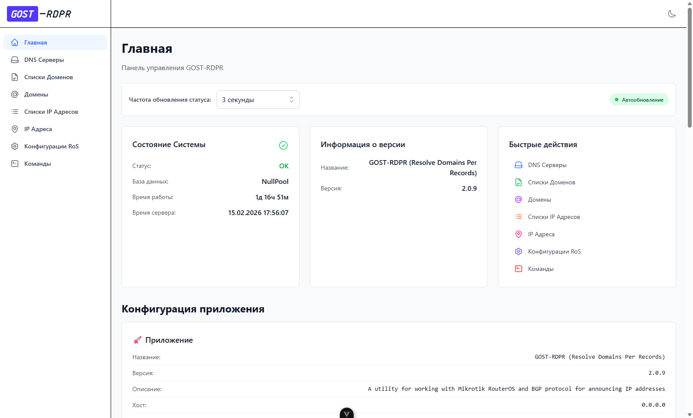
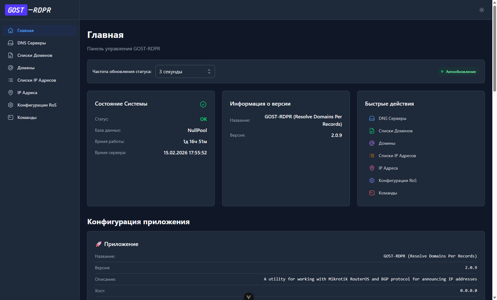
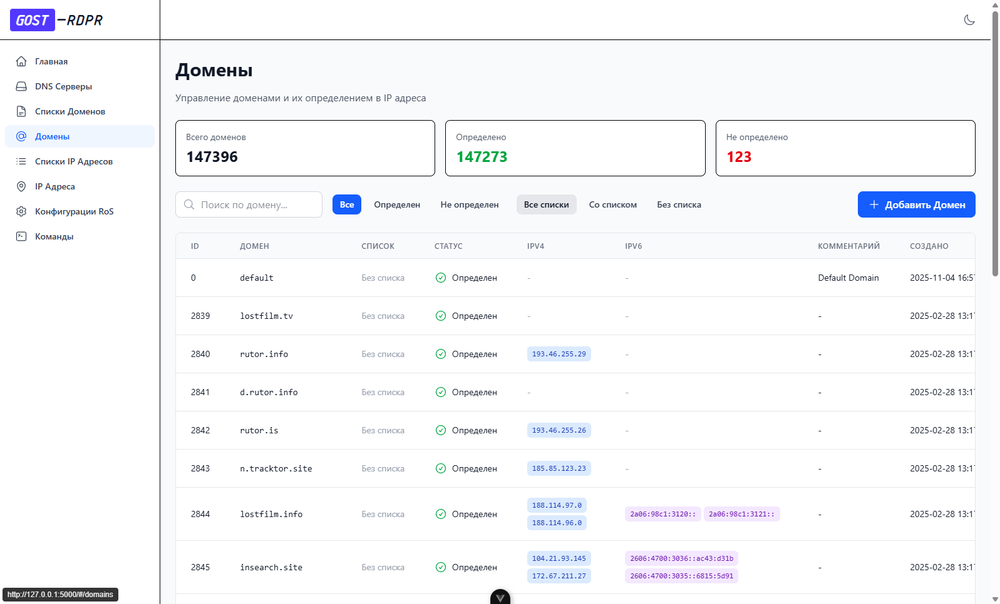
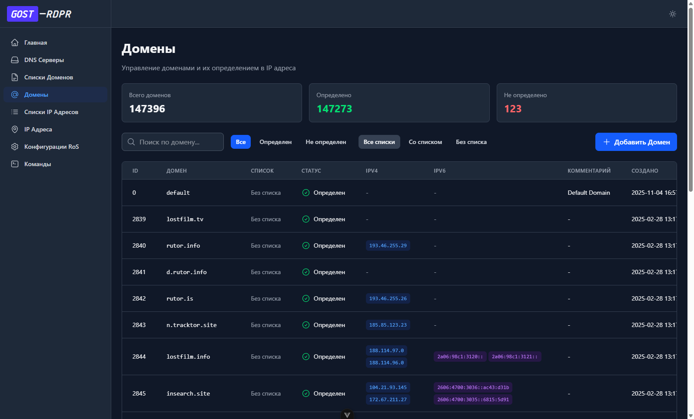

# GOST-RDPR UI

Административная панель для REST API проекта [GOST-RDPR](https://github.com/GregoryGost/gost-rdpr)

## 📸 Скриншоты

### Dashboard (Главная страница)

<table>
  <tr>
    <td width="50%">
      
      <p align="center"><i>Светлая тема</i></p>
    </td>
    <td width="50%">
      
      <p align="center"><i>Тёмная тема</i></p>
    </td>
  </tr>
</table>

**Возможности:**
- 📊 Системные метрики в реальном времени (статус, uptime, database pool)
- 🔧 Полная конфигурация приложения (42 параметра в 9 категориях)
- 🎯 Быстрый доступ ко всем разделам
- ⚙️ Настройка автообновления данных

### Управление данными (CRUD)

<table>
  <tr>
    <td width="50%">
      
      <p align="center"><i>Страница доменов - светлая тема</i></p>
    </td>
    <td width="50%">
      
      <p align="center"><i>Страница доменов - тёмная тема</i></p>
    </td>
  </tr>
</table>

**Возможности:**
- 📈 Статистические карточки с метриками
- 🔍 Поиск с debounce и минимальной длиной запроса
- 🎛️ Множественные фильтры (статус, список, тип)
- 📄 Пагинация с настраиваемым размером страницы
- ➕ Добавление, редактирование, удаление записей
- 👁️ Детальный просмотр с модальными окнами

---

## Технологический стек

- **Frontend Framework:** Vue 3.5 (Composition API)
- **Язык:** TypeScript
- **Сборщик:** Vite 7
- **Стили:** Tailwind CSS v4
- **UI Компоненты:** Headless UI + собственные компоненты
- **Иконки:** Heroicons
- **Роутинг:** Vue Router 4
- **Управление состоянием:** Pinia
- **Линтинг:** ESLint + Prettier

## Структура проекта

```
src/
├── api/                    # API слой
│   ├── client.ts           # HTTP клиент
│   ├── types/              # TypeScript типы из OpenAPI
│   └── endpoints/          # API методы по доменам
├── components/             # Переиспользуемые компоненты
│   ├── AppLogo.vue         # Логотип приложения
│   └── dashboard/          # Компоненты дашборда
├── composables/            # Переиспользуемая логика
│   ├── index.ts            # Централизованный экспорт
│   ├── useApi.ts           # API wrapper с состояниями
│   ├── usePagination.ts    # Логика пагинации
│   ├── usePaginatedData.ts # Автоматическая пагинация с загрузкой
│   ├── usePolling.ts       # Периодический опрос данных
│   └── README.md           # Документация по композаблам
├── ui/                     # UI Kit компоненты
│   ├── buttons/            # Кнопки
│   ├── forms/              # Формы (Input, Textarea, Select)
│   ├── tables/             # Таблицы и пагинация
│   ├── modals/             # Модальные окна
│   └── feedback/           # Спиннеры, пустые состояния
├── layouts/
│   ├── MainLayout.vue      # Основной layout с sidebar
│   ├── AppHeader.vue       # Заголовок с переключателем темы
│   └── AppFooter.vue       # Подвал с информацией
├── pages/                  # Страницы приложения
│   ├── HomePage.vue        # Dashboard с метриками
│   ├── dns/                # DNS серверы
│   └── commands/           # Страница команд
├── stores/                 # Pinia хранилища
│   ├── darkMode.ts         # Темная тема
│   └── settings.ts         # Настройки приложения
├── css/                    # Стили
│   ├── main.scss           # Главный файл стилей
│   ├── fonts/              # Шрифты
│   └── vendor/             # Сторонние стили
└── router/                 # Vue Router
    └── index.ts

```

## Реализованные функции

### ✅ Базовая функциональность завершена (100%)

1. **API Слой (100%)**
   - Базовый HTTP клиент с обработкой ошибок
   - TypeScript типы из OpenAPI спецификации
   - API endpoints для всех разделов:
     - DNS серверы
     - Списки доменов
     - Домены
     - Списки IP адресов
     - IP адреса
     - Конфигурации RouterOS
     - Команды
   - Типобезопасные хелперы для работы с параметрами запросов

2. **Composables (4 композабла)**
   - `usePaginatedData` - автоматическое управление пагинацией с загрузкой данных
   - `usePagination` - базовое управление состоянием пагинации
   - `usePolling` - периодический опрос данных
   - `useApi` - wrapper для API запросов с обработкой ошибок

3. **Глобальная обработка ошибок**
   - Автоматический перехват ошибок Vue, промисов и JavaScript
   - Система уведомлений с разными уровнями серьезности
   - Централизованный ErrorHandler для всего приложения
   - Вспомогательные функции для показа уведомлений

4. **UI Kit (11 компонентов)**
   - BaseButton - кнопка с вариантами стилей
   - BaseInput, BaseTextarea, BaseSelect - формы
   - DataTable, PaginationControl - таблицы с адаптивной пагинацией
   - BaseModal, ConfirmDialog - модальные окна
   - LoadingSpinner, EmptyState - feedback компоненты
   - ErrorNotification - система уведомлений об ошибках

5. **Layouts**
   - MainLayout - адаптивный layout с sidebar и темной темой
   - AppHeader - заголовок с логотипом и переключателем темы
   - AppFooter - подвал с информацией и ссылками
   - Полностью responsive дизайн (Mobile, Tablet, Desktop)

6. **Страницы (8 страниц)**
   - **HomePage** - dashboard с метриками системы, автообновлением и полной конфигурацией
   - **DnsServersPage** - CRUD для DNS серверов
   - **DomainsListsPage** - CRUD для списков доменов с фильтрацией по статусу
   - **DomainsPage** - CRUD для доменов с фильтрацией и статистикой
   - **IpsListsPage** - CRUD для списков IP адресов
   - **IpsPage** - CRUD для IP адресов с множественной фильтрацией (IPv4/IPv6, список, домен)
   - **RosConfigsPage** - CRUD для конфигураций RouterOS (пароли скрыты)
   - **CommandsPage** - выполнение системных команд
   - **NotFoundPage** - страница 404 с навигацией

7. **Адаптивность**
   - Mobile-first подход
   - Оптимизация для разрешений: Mobile (375px), Tablet (768px), iPad Pro (1024px), Desktop (1920px)
   - Адаптивная пагинация (упрощенная на мобильных, полная на desktop)
   - Responsive таблицы с горизонтальной прокруткой
   - Адаптивные формы и модальные окна

## Установка и запуск

### Установка зависимостей

```bash
pnpm install
```

### Настройка окружения

Создайте файл `.env.development`:

```env
VITE_API_BASE_URL=http://127.0.0.1:4000
```

**Примечание:** В режиме разработки используется Vite proxy для обхода CORS. Все запросы к `/api` автоматически проксируются к API серверу, указанному в `VITE_API_BASE_URL`.

### Запуск в режиме разработки

```bash
pnpm dev
```

Приложение будет доступно по адресу: `http://localhost:5000`

### Сборка для продакшена

```bash
pnpm build
```

### Линтинг и форматирование

```bash
# Проверка типов TypeScript
pnpm type-check

# Линтинг dry-run (без изменений файлов)
pnpm lint-dry-run

# Форматирование кода
pnpm format
```

## Функциональность

### Главная страница (Dashboard)

- Мониторинг состояния системы (статус, uptime, база данных)
- Информация о версии приложения
- Полная конфигурация приложения (42 параметра в 9 категориях)
- Быстрые действия (навигация по разделам)
- Автообновление данных с настраиваемым интервалом

### DNS Серверы

- Просмотр списка DNS серверов с пагинацией (10/20/50/100 на странице)
- Поиск по серверам
- Добавление новых DNS серверов (IPv4/IPv6/DoH)
- Удаление DNS серверов с подтверждением

### Списки Доменов

- Управление списками доменов для автоматической загрузки
- Статистика по спискам (всего, без ошибок, с ошибками, критические)
- Фильтрация по статусу загрузки
- Поиск по названию или URL
- Просмотр деталей списка (ID, URL, hash, количество доменов)

### Домены

- Управление доменами и их определением в IP адреса
- Статистика (всего доменов, определено, не определено)
- Фильтрация по статусу определения и спискам
- Поиск по домену
- Отображение IPv4 и IPv6 адресов

### Списки IP Адресов

- Управление списками IP адресов для автоматической загрузки
- Статистика по спискам
- Фильтрация по статусу загрузки
- Поиск по названию или URL
- Отображение количества IPv4 и IPv6 адресов

### IP Адреса

- Управление IP адресами для RouterOS конфигураций
- Статистика (всего, IPv4, IPv6, со списком, с доменом)
- Множественная фильтрация (тип, список, домен)
- Поиск по IP адресу
- Отображение связей с доменами и списками

### Конфигурации RouterOS

- Управление конфигурациями RouterOS для автоматического развертывания
- Добавление конфигураций (хост, пользователь, пароль, BGP список)
- Безопасное хранение паролей (скрыты в UI)
- Поиск по хосту, пользователю или BGP списку

### Команды

- Загрузка списков доменов и IP адресов (с принудительной перезагрузкой)
- Определение доменов в IP адреса через DNS
- Обновление конфигураций RouterOS (с фильтром по типу IP)
- Подтверждение перед выполнением команд

### Темная тема

- Автоматическое определение системной темы
- Переключатель темы в header
- Сохранение предпочтений в localStorage
- Полная поддержка dark mode во всех компонентах

## Рекомендуемая IDE

- [Cursor](https://cursor.sh/) / [VS Code](https://code.visualstudio.com/)
- Расширение: [Vue Language Features (Volar)](https://marketplace.visualstudio.com/items?itemName=Vue.volar)

## Браузерные расширения

- [Vue.js devtools](https://chromewebstore.google.com/detail/vuejs-devtools/nhdogjmejiglipccpnnnanhbledajbpd)

## Архитектурные решения

### Композаблы для управления данными

Проект использует современный подход с композаблами для управления состоянием:

- `usePaginatedData` автоматически связывает пагинацию с загрузкой данных
- Централизованный экспорт через `src/composables/index.ts`
- Полная типобезопасность через TypeScript generics
- Уменьшение кода страниц на ~40 строк

### Типобезопасность

- Отказ от использования типа `any`
- Хелпер-функции для работы с URL параметрами (`toSearchParams`)
- Строгая типизация для всех API запросов
- TypeScript strict mode без предупреждений

### Централизация констант

Полная централизация всех констант проекта в `src/constants.ts`:

- **UI тексты** (~250+ строк): заголовки, описания, терминология для всех страниц
- **Конфигурация API**: timeout, fallback URL, заголовки
- **Конфигурация stores**: cache TTL, polling интервалы
- **Storage keys**: ключи для localStorage
- **Настройки пагинации и поиска**: размеры страниц, минимальная длина
- **Валидация**: минимальные длины для полей форм
- **Сообщения об ошибках**: централизованные тексты ошибок
- Готовность к локализации (i18n)

### Обработка ошибок

- Singleton ErrorHandler с автоматическим перехватом
- Pinia store для управления уведомлениями
- Severity levels (INFO, WARNING, ERROR, CRITICAL)
- Автоматическое закрытие уведомлений

## Следующие шаги

1. ✅ ~~Реализовать все CRUD страницы~~ Готово
2. ✅ ~~Реализовать систему уведомлений~~ Готово
3. ✅ ~~Проверить адаптивность на всех разрешениях~~ Готово
4. ⏳ Добавить unit тесты для композаблов
5. ⏳ Добавить E2E тесты с Playwright
6. ⏳ Оптимизация производительности
7. ⏳ Accessibility улучшения (ARIA, keyboard navigation)

## Документация

- [Руководство по разработке](DEVELOPMENT.md)
- [Статус проекта](PROJECT_STATUS.md)
- [Документация Composables](src/composables/README.md)
- [OpenAPI спецификация](TARGET_OPENAPI.md)
- [Setting up Cursor + Playwright MCP for a Next.js Project](https://gist.github.com/weber-stephen/e27c4f6abde0b89a21e8569f22fd7a8c#file-setting-up-cursor-playwright-mcp-for-a-next-js-project-md)

## Лицензия

Все исходные материалы проекта распространяются под лицензией [GPL v3](./LICENSE 'Описание лицензии'). Вы можете использовать проект в любой форме, в том числе в коммерческих целях, но следует помнить, что автор проекта не предоставляет никаких гарантий работоспособности исполняемых файлов, а также не несет никакой ответственности за претензии или причиненный ущерб.

Данное приложение использует внешние модули. Авторы этих модулей несут (или не несут) ответственность за качество и стабильность работы этих модулей. См. лицензии этих модулей. Внешние модули перечислены в файле зависимостей файла `package.json`.

## Об авторе

GregoryGost - <https://gregory-gost.ru>
