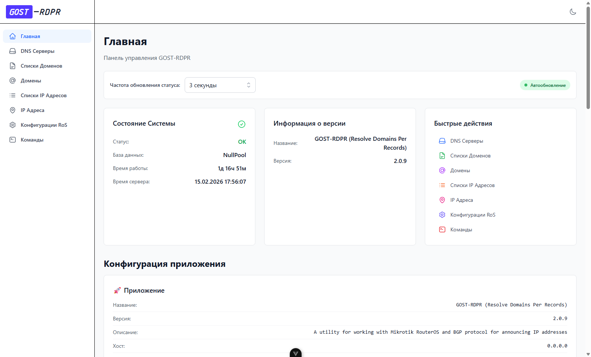
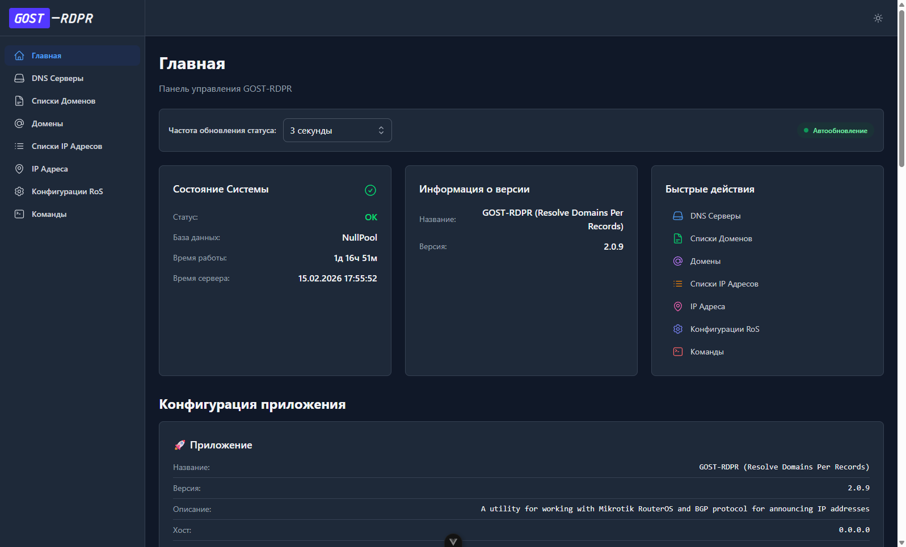
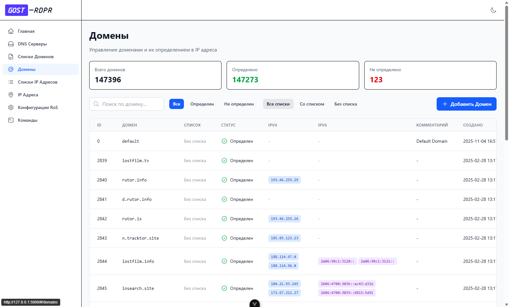
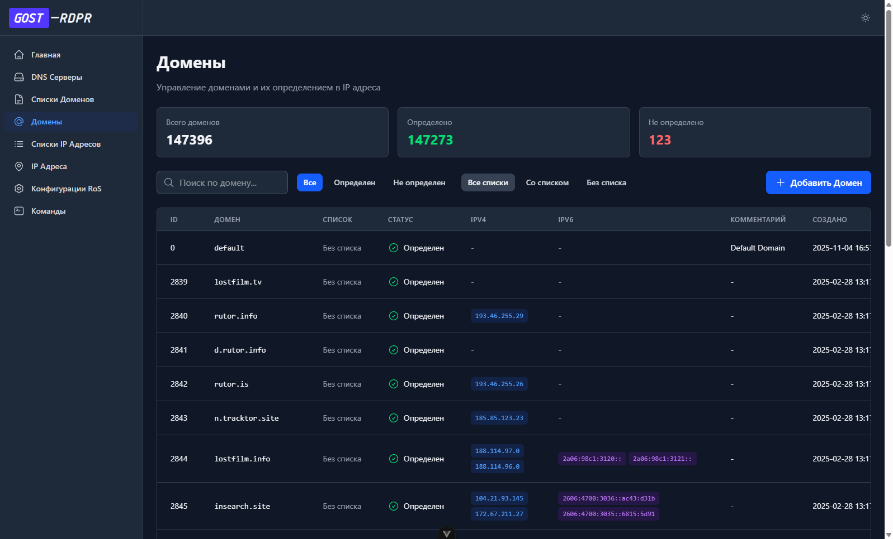

# GOST-RDPR UI

Административная панель для REST API проекта [GOST-RDPR](https://github.com/GregoryGost/gost-rdpr).

Реализует полный CRUD-интерфейс для управления DNS-серверами, доменами, IP-адресами, конфигурациями RouterOS и командами, а также страницу статистики с интерактивными графиками.

## Скриншоты

<table>
  <tr>
    <td width="50%">
      
      <p align="center"><i>Главная — светлая тема</i></p>
    </td>
    <td width="50%">
      
      <p align="center"><i>Главная — тёмная тема</i></p>
    </td>
  </tr>
  <tr>
    <td width="50%">
      
      <p align="center"><i>Домены — светлая тема</i></p>
    </td>
    <td width="50%">
      
      <p align="center"><i>Домены — тёмная тема</i></p>
    </td>
  </tr>
</table>

## Быстрый старт

```bash
pnpm install
```

Создайте файл `.env.development`:

```env
VITE_API_BASE_URL=http://127.0.0.1:4000
```

```bash
pnpm dev        # http://localhost:5000
pnpm build      # production сборка
pnpm type-check # проверка TypeScript
pnpm format     # форматирование кода
```

> В режиме разработки запросы к `/api` автоматически проксируются к `VITE_API_BASE_URL`.

## Технологии

| Категория           | Технология                          |
| ------------------- | ----------------------------------- |
| Framework           | Vue 3.5 (Composition API, `<script setup>`) |
| Язык                | TypeScript ~5.9                     |
| Сборщик             | Vite 7                              |
| Стили               | Tailwind CSS v4                     |
| UI-компоненты       | Headless UI, Heroicons              |
| Роутинг             | Vue Router 4                        |
| Управление состоянием | Pinia 3                           |
| Линтинг             | ESLint 9 + Prettier                 |

**Требования:** Node.js `^20.19.0 || >=22.12.0`, пакетный менеджер `pnpm`.

## Разделы

- **Главная** — системные метрики, конфигурация, автообновление
- **DNS Серверы** — управление серверами (Classic / DoH)
- **Списки доменов** — управление источниками доменов
- **Домены** — управление доменами и их резолвингом
- **Списки IP** — управление источниками IP-адресов
- **IP Адреса** — управление адресами (IPv4 / IPv6)
- **Конфигурации RoS** — конфигурации RouterOS
- **Команды** — выполнение системных команд
- **Статистика** — динамика роста, разбивка по спискам, графики

## Рекомендуемая IDE

[Cursor](https://cursor.sh/) / [VS Code](https://code.visualstudio.com/) + расширение [Volar](https://marketplace.visualstudio.com/items?itemName=Vue.volar)

## Документация

- [Руководство по разработке](DEVELOPMENT.md)
- [OpenAPI спецификация](TARGET_OPENAPI.md)
- [Документация composables](src/composables/README.md)

## Лицензия

Все исходные материалы проекта распространяются под лицензией [GPL v3](./LICENSE). Автор не предоставляет гарантий работоспособности и не несёт ответственности за претензии или причинённый ущерб.

## Об авторе

GregoryGost — <https://gregory-gost.ru>
